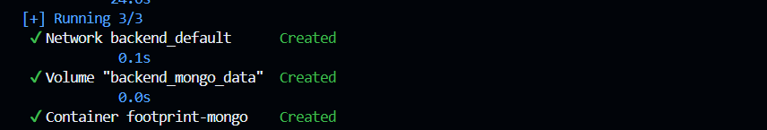
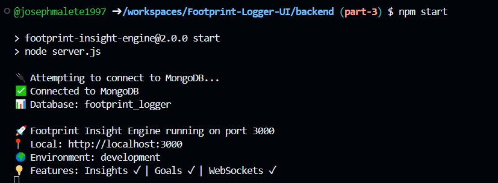
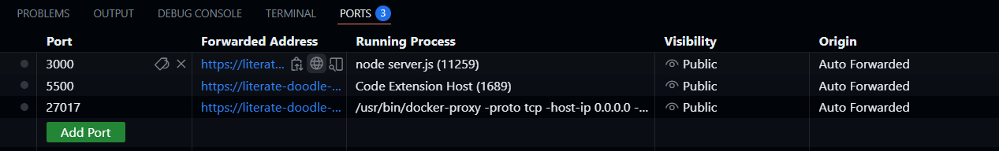
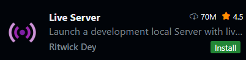
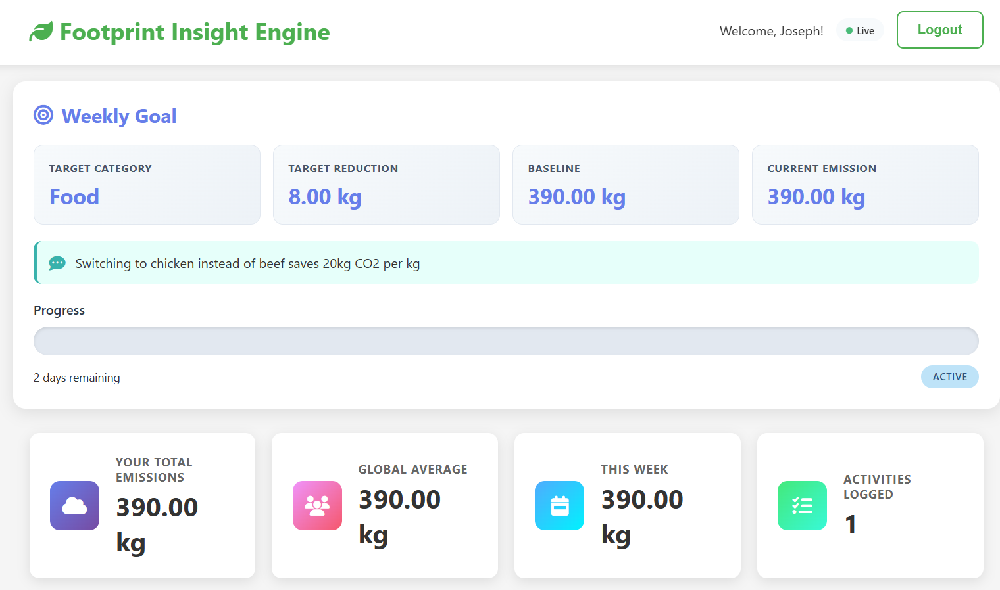

## Follow the below steps on how to run this projects

### Step 1:
Navigate to the **Backend** directory
```
cd backend
```

### Step 2:
Install dependencies
```
npm install
```

### Step 3:
Run Docker compose command to connect to the MongoDB server(If you don't have docker installed in your local machine you can use github codespaces)
```
docker-compose up
```
You should get something like this:


### Step 4:
Open another terminal and cd into **backend** directory to run the server
```
npm start
```
You should get the following results:


### Step 5:
Navigate your **public** directory and go to your **auth.js** and replace your **API_BASE** url.
```
const API_BASE = 'https://literate-doodle-w69w69ggj763p5-3000.app.github.dev/api';
```
- If you are using codespaces you can find it here under Forwarded ports(Make sure your ports visibilities are set to **public**):


- If your are using a **cloned repository** in your local computer you can use this **API_BASE** url.
```
const API_BASE = 'http://localhost:3000/api';
```

### Step 6:
Follow **step 5** to replace **API_BASE** url in **Public/dashboard.js** file.

### Step 7:
Well done if your backend is running, so now we will have to run our front-end.
Install **Live server** extension:


Now you can preview your **index.html** file. Finally you can register to create an account to use the application:


If you have followed correctly all the steps you should get something like this:


## Note if you are struggling to set-up the projects you can email me for a live google meet session:
### - joseph.malete@umuzi.org